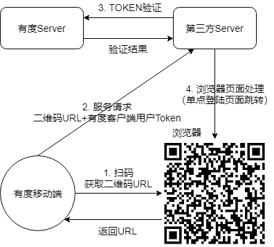

# 扫码登录

如果业务系统希望使用有度帐号体系登录，通过有度手机端扫码是一种比较理想的解决方法。

二维码的链接带有$TOKEN$模版参数，有度手机端扫二维码时，会将$TOKEN$替换为实真的token，然后再访问此链接，从而实现通过有度手机扫码单点登录进入业务系统。

集成开发时，建议先使用文明链接先调试，通过之后再生成二维码集成。

扫码登录流程图:

**说明：**

二维码由第三方服务器提供，需包含服务地址URL。

第1、2步由有度客户端完成。

第3、4步由第三方服务自己完成

扫码登录前面步骤与[有度单点登录其他系统](https://youdu.im/api/doc.html#100341)步骤一样，第4步第三方Server验证token成功后，通过websocket通知二维码页面进入系统。