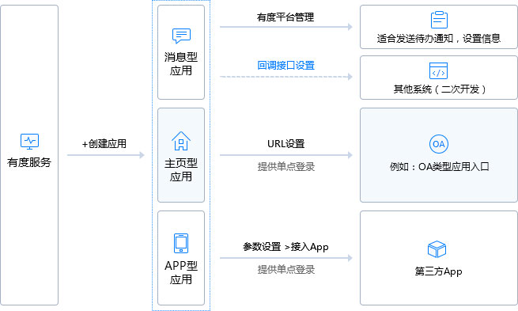

# 说明

有度服务端提供开放API接口，用来与企业内部的其他系统集成，致力于建立统一、互相协作的企业系统生态圈。
本文详细介绍有度服务器API接口，涉及集成流程、数据加解密、全局状态码、接口说明，提供给需要全面了解有度接口的开发人员查阅。

[有度SDK](https://github.com/youduim/youdu-sdk-java)封装了API接口，屏蔽了底层调用接口加解密等细节，使集成开发更便捷。
如果您只需集成某一个功能，建议直接查阅[集成案例](https://youdu.im/api/doc.html#10012)。

## 有度应用模型

