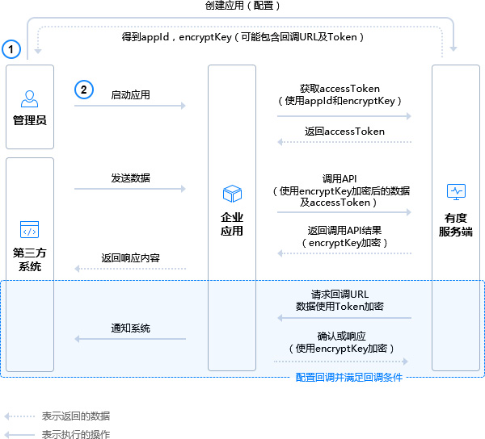

# 常见的集成模型

1.创建应用，配置应用信息。
2.参阅相关的接口文档。
3.遵循接口文档及配置开发应用（使用应用信息栏展示的身份标识、对称加密密钥等信息，应用配置可调整）。
4.运行应用。

> 关于回调：
> 回调是有度服务端主动发起的，特定条件触发，非必须配置。
> 触发条件：
> 部分系统配置或客户端请求。
> 当触发回调时，若应用未配置回调信息或回调响应失败（包含超时），导致回调失败。
> 通知类回调失败会导致应用侧丢失通知信息，请求类回调失败导致业务请求失败。