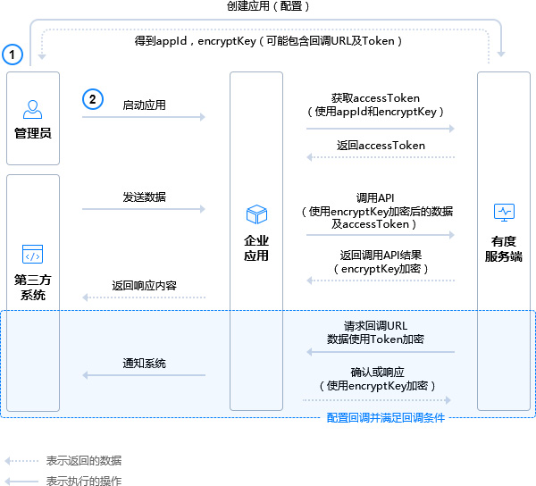

# 应用开发流程概述

1.创建应用，配置应用信息。
2.参阅相关的接口文档。
3.遵循接口文档及配置开发应用（使用应用信息栏展示的身份标识、对称加密密钥等信息，应用配置可调整）。
4.运行应用。

> 关于回调：
> 回调是有度服务端主动发起的，特定条件触发，非必须配置。
> 触发条件：
> 部分系统配置或客户端请求。
> 当触发回调时，若应用未配置回调信息或回调响应失败（包含超时），导致回调失败。
> 通知类回调失败会导致应用侧丢失通知信息，请求类回调失败导致业务请求失败。

## 创建应用

1.组织架构应用（包含组织架构（部门、账号）同步，群同步，LDAP第三方认证功能）已经由系统预置。会话消息回调功能目前仅支持消息审计插件。
2.其他应用点击创建应用，并填写应用名称及描述，客户端可见的应用将会展示这些信息。
3.选择应用可见范围（针对客户端的应用），默认全部人员可用。

## 配置应用

配置应用功能，包括主页，自动回复，自定义菜单，回调接口等，请按需配置即可。

> 对于需要接受客户端或服务端输入数据的应用，需要配置回调信息，并开发回调相关功能。
> 例如，应用如果需要接受用户菜单或文本输入时，需要回调功能。
> 对于自开发的组织架构应用，如果组织架构中包含第三方认证的，则一定需要配置回调并能正确响应回调，否则该用户无法登录

## 开发应用

使用该应用的ID,加密KEY及回调token、url开发应用。
您还可以随时可以通过界面的发送消息入口，发送应用消息。

###### api接口调用通用流程

1.使用AppId获取AccessToken
2.遵照接口构造请求数据，并使用EncodingAESKey加密封装请求。
3.调用API接口，检查请求结果
4.使用EncodingAESKey解密响应数据

## 回调

回调过程是指有度服务端主动发送数据给应用。
回调触发可能是以下的一种：

- 应用的API请求触发（异步响应）。如全同步组织架构，不会立即返回同步结果（返回OK表示请求已收到）同步结果需通过回调或轮询获取。
- 应用配置的系统触发，如消息型应用收到用户发送来的消息，此时有度后台将通过回调将消息发给应用。

回调分两类：

- 通知类：告知应用内容，应用无需数据应答(可以根据内容异步触发API请求) 。该类应立即回复确认（全局状态码为0）。应用没有及时回应或回应不符合格式，判定为回调失败。
- 请求类：应用需同步返回处理结果，结果不及时或解析错误判定为回调失败。

> 对于通知类的请求有度服务器会在24小时内间断的重发请求

###### 回调通用流程

1.有度服务端将数据加密处理。
2.有度服务端将数据发送到配置的回调URL。
3.企业应用收到回调请求，验证请求。
4.解密数据，响应相关的指令，并按要求回复。

> 对于配置回调的应用，应当总是保持运行状态，迅速响应回调请求。