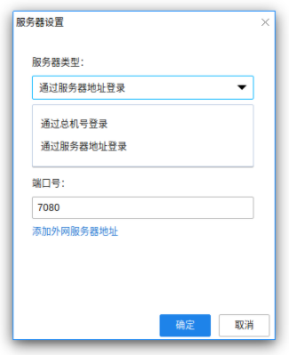

# Linux客户端登录

Linux客户端登录需要设置好服务器信息和登录模式之后，才可以进行正常登录。

## 1. 服务器设置

安装完成，运行进入登录界面，点击右上角的服务器设置按钮，进入设置界面，如下图：

请根据贵司管理员的要求选择相应类型，并填写相关的信息，点击确定以保存。

## 2. 选择登录模式

目前支持三种登录模式：帐号登录、手机号登录、二维码登录。

### 2.1 账号密码方式登录

### 2.2 手机号方式登录

输入手机号之后，通过短信验证码进行登录。

### 2.3 二维码方式登录

二维码方式需要先成功登录手机客户端，通过手机客户端的扫一扫功能，扫描二维码登录。

请根据贵司管理员要求选择登录模式以及完成相关信息输入。