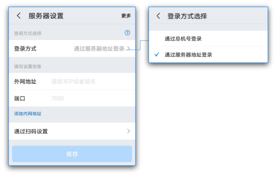
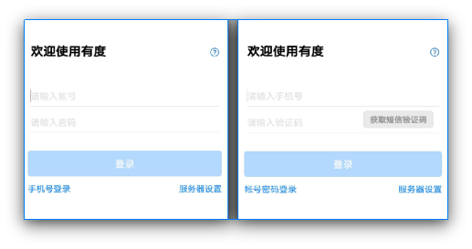

# 手机客户端登录指南

Linux客户端与Windows客户端一样，需要需要设置好服务器信息和登录模式之后，才可以进行正常登录。

## 1. 服务器设置

安装完成，进入登录界面，点击右下角服务器设置按钮；

服务器类型有两种：

 1. 通过服务器地址登录

 2. 通过总机号登录

如下图：

请根据贵司管理员的要求选择相应类型，并填写相关的信息，点击确定保存。

## 2. 选择登录模式

手机客户端支持两种登录模式：账号密码登录和手机号登录。默认的方式是账号密码登录，可以点击“手机号登录”的链接，切换到手机号登录的方式。

如下图：

请根据贵单位管理员要求选择登录模式以及完成相关信息输入。

