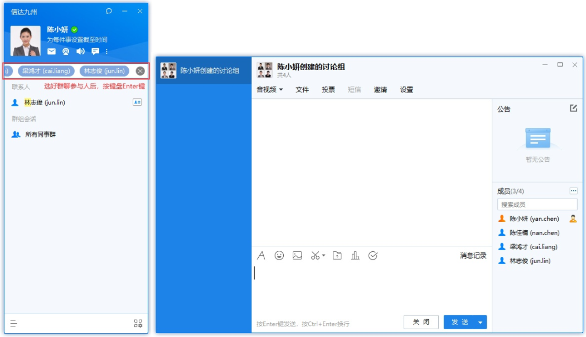

# Windows客户端会话指南

## 1.会话界面

会话列表根据时间由新到旧显示会话，您可以快速查找近期会话，左键双击快速打开会话窗口。

进入单人或群组会话窗口，窗口内可发送文字、表情、文件等进行日常沟通，还可以查阅之前的消息记录。

## 2.发起单人会话

鼠标左键双击同事帐号，进入会话窗口：

鼠标右键单击同事帐号，点击发起会话：

同事个人资料卡的右下角，点击发消息：

## 3.发起群组会话

打开会话窗口，点击邀请，选择参与者，点击确定：

点击搜索框，搜索后单击选中参与者，选完后按Enter键发起会话：

选中部门，单击右键，发起部门群聊：

## 4.发送文件

点击会话窗口的文件按钮，选取文件：

直接把文件移动或者粘贴在会话窗口：

