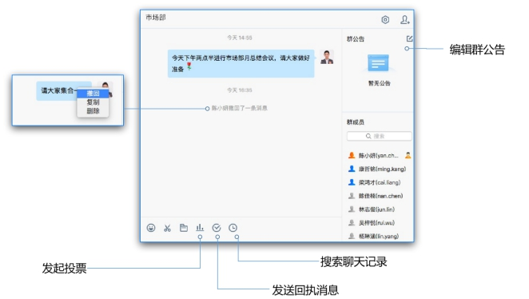
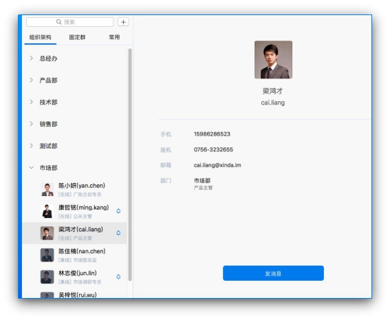
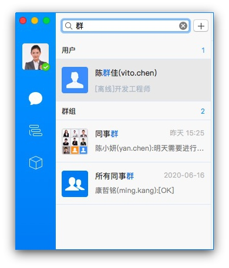
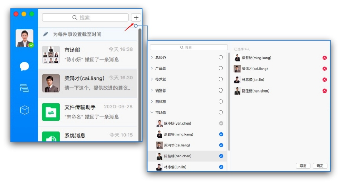
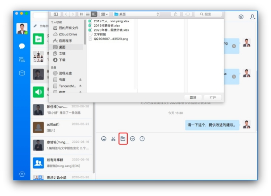
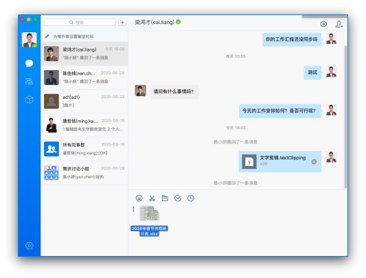

# Mac端会话消息

## 1.会话界面

会话列表根据时间由新到旧显示会话，您可以快速查找近期会话，左键单击快速进入会话窗口。

进入单人或群组会话窗口，窗口内可发送文字、表情、文件等进行日常沟通，还可以查阅之前的消息记录。

## 2.发起单人会话

在组织架构中，鼠标左键双击账号或者单击显示资料卡，点击发消息，即可发起单人会话。

通过顶部搜索框，搜索账号，单击打开会话窗口，即可发起个人会话。

## 3.发起群组会话

打开单人会话窗口，点击窗口右上角，选择参与者，点击确定；

点击顶部【+】，选择参与者，点击确定发起群组会话。

## 4.发送文件

点击会话窗口的文件按钮选取文件；

 直接拖拽文件或复制粘贴文件至会话窗口。

