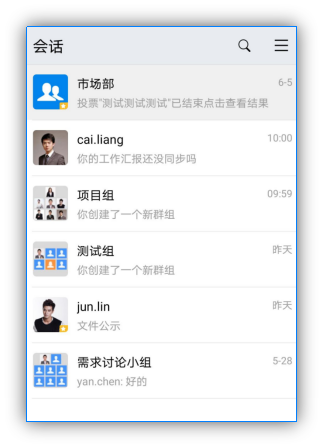
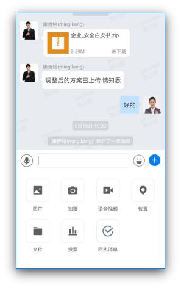
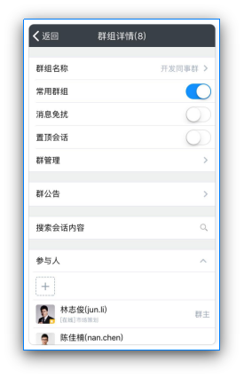
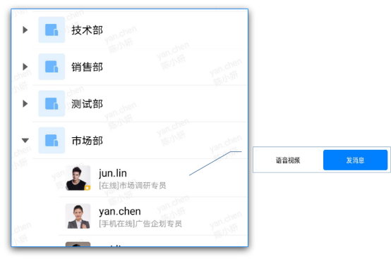
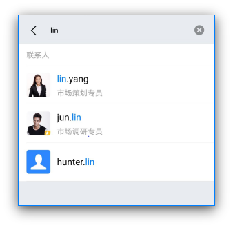
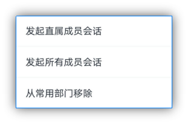
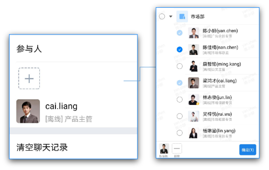

# 手机端会话消息

## 1.会话界面

### 1.1 会话列表

会话列表根据时间由新到旧显示会话记录，您可以快速查找近期会话，点击会话即可快速进入会话窗口。

点击右上角，可选择发起会话、扫一扫和管理会话。

### 1.2 会话内容页

进入会话内容页，支持发送图片、文件、位置消息、拍照、录像、语音视频、回执消息。

### 1.3 会话详情页

支持设置常用、消息免扰、置顶会话、群公告、搜索会话内容、增删会话成员、进行群管理。

## 2.发起个人会话

在组织架构界面中，找到对应的同事账号，点击进入个人资料卡视图，点击右下角的【发消息】即可发起会话。

使用搜索窗口，搜索联系人，点击账号进入个人资料卡视图，点击【发消息】即可发起会话。

在群组详情界面中，点击参与人列表中账号，即可发起会话。

## 3.发起群组会话

切换至固定群界面，在固定群列表中，选择需要发起会话的群，点击即可发起会话。

如果需要发起部门或者全员的讨论群组会话，在组织架构中，长按部门，根据弹出的选项进行发起。

在个人会话中，如果需要拉取更多成员进行会话时，可在个人会话详情中的参与人列表中，点击【+】选择需要添加的成员，即可发起群组会话。

