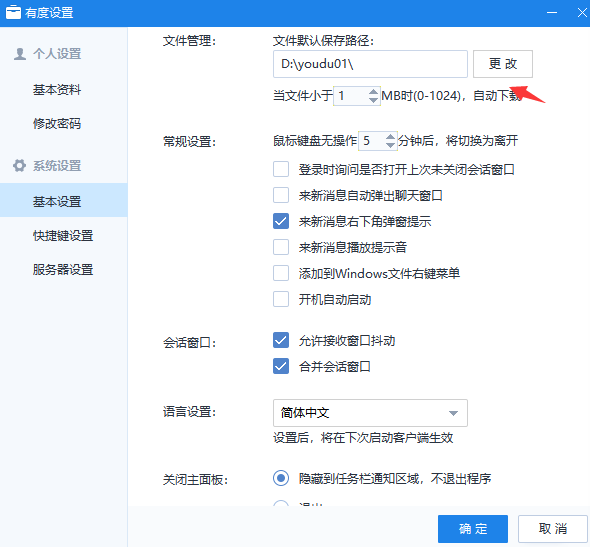
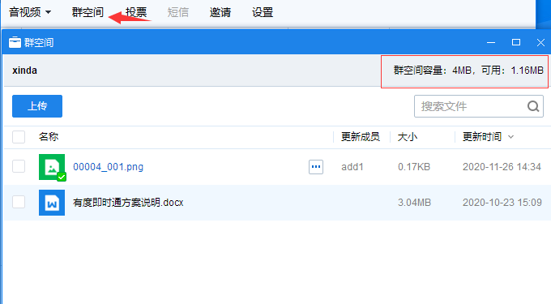

## 客户端无法发送广播消息或短信？

  有度客户端发送广播消息或短信权限，需要有度管理员统一设置，客户端广播消息和短信按钮显示为灰色状态时;
  一般情况是有度管理员未给当前有度账号设置广播消息或发送短信权限;
  如需使用，请联系单位管理员确认或配置使用权限即可。

## 如何修改Windows客户端文件保存路径？

　详细操作：

1. 打开有度设置，可点击主面板头像打开；
2. 选择基本设置，修改文件管理中的文件保存路径；
3. 选择更改，重新配置文件保存的目标路径即可。

## 客户端会话相关问题

#### 场景：

- #### 收发不了新消息；

- #### 聊天记录加载不出来；

- #### 会话无法正常打开。

  

严格意义上来说，客户端出现以上问题时，都是需要寻求单位管理员的帮助，但是在此之前，可以参考以下排查思路进行确认。

1. 登录其他同事账号，确认消息发送或者打开会话等操作是否正常；

  如果其他同事账号表现都为异常，考虑有可能是有度服务异常，此时直接联系管理员反馈问题。

2. 如果其他同事登录使用都表现正常，那么考虑有可能是客户端本地缓存数据存在问题，建议先参考以下操作：

- Windows客户端：

  退出客户端，进入我的文档\youdu\个人文件夹（总机号+一串数字）\db目录，将session.db重命名（比如添加1），重新登录客户端。

- Mac客户端 ：

  退出客户端，打开"/Users/电脑用户名/Library/Containers/im.xinda.youdu.mac/Data/Library/youdu/个人文件夹（总机号+一串数字）"，重命名或者删除session.db、msg.db，如果存在多个帐号，直接在youdu/下搜索session.db，msg.db，然后再重命名或者删除。

  >如果未能找到文件夹，可能被隐藏了，您可以自行打开。https://www.jianshu.com/p/14c31ae9c6c6

- 手机端直接卸载重装。

3.  以上操作如无法恢复正常使用，联系单位管理员，进一步确认。

## 客户端文件发送问题

- #### 固定群发送文件，提示为“群空间不足，无法上传如下文件xxxxx”

由于在固定群发送文件时，默认都是会上传至群空间，便于群员下载；

如果出现以上提示，请检查群空间可用空间是否充足；

如空间不足，联系单位管理员进行群空间扩容。

## 聊天记录查看问题

- #### 会话记录中，文件或图片提示“服务器文件已过期”

正常情况下，聊天记录中的文件或图片会识别本地已下载的缓存数据；如果本地无缓存数据时，客户端可以从服务器下载；

一旦客户端本地和服务器上都不存在该文件或图片数据时，在客户端的会话记录中会显示为灰色，并且存在提示“服务器文件已过期”等字样，无法重新下载获取。

