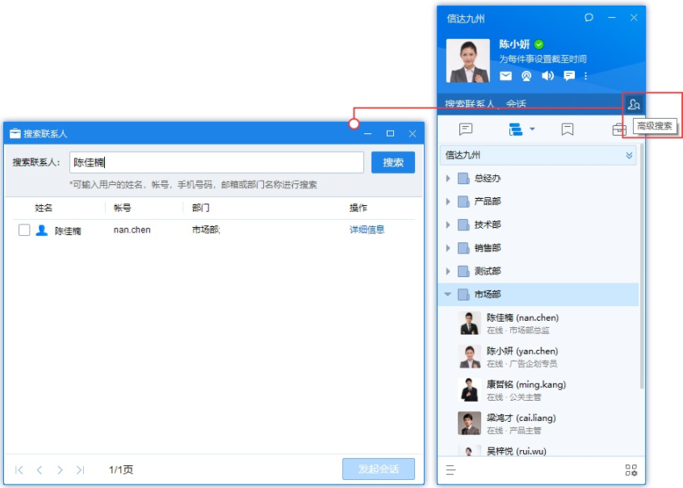

# 通讯录使用指南

## 1. Windows客户端

### 1.1 通讯录界面

移动鼠标至同事帐号，将展示该同事的个人资料卡

### 1.2 通讯录里找同事

可以通过如下方式找同事：

- 直接在组织架构里面找

- 点击搜索框，在搜索框内输入其姓名或者帐号进行模糊搜索

- 点击高级搜索：可输入同事的姓名、帐号、手机号码、邮箱或部门名称进行搜索

## 2. Mac客户端

### 2.1 通讯录界面

鼠标单击同事帐号，将展示该同事的个人资料卡。

### 2.2 通讯录中查找同事

可以通过如下方式找同事：

- 直接在组织架构中点开查找

- 点击窗口顶部搜索框，在搜索款给输入姓名或账号可进行模糊搜索。

## 3. Linux客户端

### 3.1 通讯录界面

鼠标点击同事帐号，将展示该同事的个人资料卡

### 3.2 通讯录中查找同事

可以通过如下方式找同事：

- 直接在组织架构里面找；

- 点击搜索框，在搜索框内输入其姓名、账号或者包含该同事的会话进行模糊搜索。

## 4. 手机客户端

### 4.1 通讯录界面

通讯录以树状形式展示企业组织架构的，点击部门可进行展开，显示该部门所有成员；选择点击同事，将展示同事的个人资料卡。

### 4.2 通讯录中查找同事

可以通过如下方式找同事：

- 直接在组织架构中点击对应部门，进行准确人员查找；

- 使用搜索按钮，指定搜索内容为联系人，可进行精准或模糊查找。

