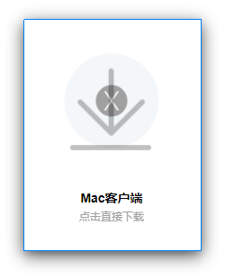
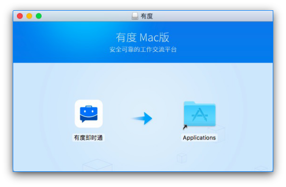

# Mac客户端下载和安装

本文将介绍如何下载和安装有度Mac客户端。

## 下载及安装

1.访问官网的[下载页面](https://youdu.im/download.html)

2.点击下载**Mac客户端**

   

3.下载完成后，在Finder中打开下载文件夹

4.双击打开 youdu-client-mac_X.X.X.dmg

5.拖动有度图标到右侧的 Applications 文件夹

   

6.从启动台或应用文件夹启动有度即时通

7.有度即时通启动后，设置**服务器设置**信息，输入你的帐号和密码并登录

## 系统要求

- 支持的系统版本：macOS 10.11 及更高

- 如果你正在使用 macOS 10.10 或更低版本，请参考苹果的[说明](https://support.apple.com/zh-cn/HT201475)来升级到最新版本的 macOS

