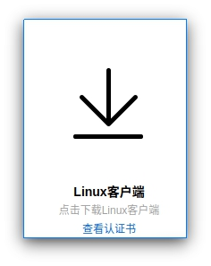
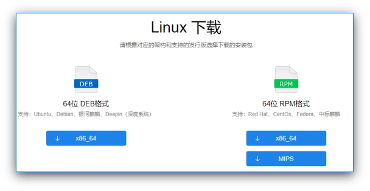
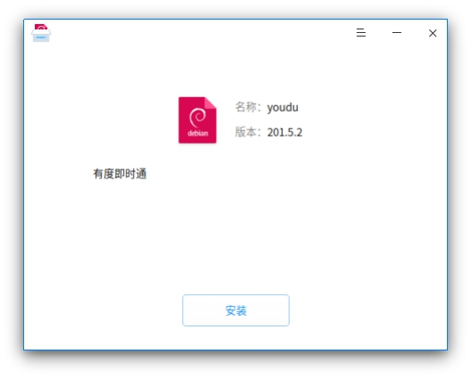
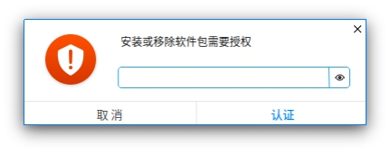

# Linux客户端下载和安装

本文将介绍如何下载和安装有度Linux客户端。

## 下载及安装

1.访问官网的[下载页面](https://youdu.im/download.html)

2.点击Linux客户端下载

3.选择安装包

Linux客户端支持DEB和RPM格式，用户可根据实际客户端系统进行下载安装使用。

4.下载完成后，解压缩

5.双击运行安装包，点击安装

6.授权安装

提示安装需要授权时，输入当前登录系统账号的密码，点击认证后等待程序安装完成即可

