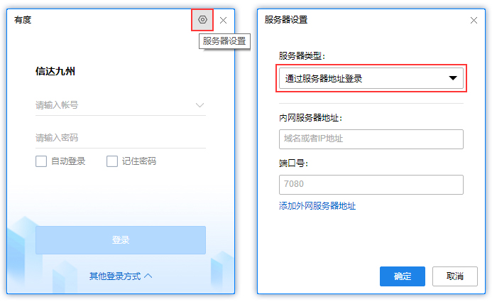

# Windows客户端使用手册

## 1. 安装

1.1 找到下载的Windows客户端安装包，双击打开安装包

1.2 选择安装语言

1.3 点击安装

 

1.4 安装完成

## 2. 登录

**要成功登录，第一步要先完成服务器设置，第二步要选择登录模式，完成帐号信息设置。**

### 2.1 服务器设置

安装完成将进入登录界面，点击右上角的服务器设置按钮；

服务器类型有两种：1)通过服务器地址登录，2)通过总机号登录；

请根据贵司管理员的要求选择相应类型，并填写相关的信息，点击确定以保存。

### 2.2 选择登录模式

目前支持三种登录模式：帐号登录、手机号登录、二维码登录；

请根据贵司管理员要求选择登录模式以及完成相关信息输入。

- 帐号登录：输入帐号密码

- 手机号登录：输入手机号，获取短信验证码

- 二维码登录：打开已登录的有度移动端，点击右上角图标，选择【扫一扫】，扫描登录界面的二维码。

## 3. 通讯录

### 3.1 通讯录界面

通讯录界面是以树状形式展示企业组织架构，移动鼠标至同事帐号，将展示该同事的个人资料卡

### 3.2 通讯录里找同事

- 直接在组织架构里面找
- 点击搜索框，在搜索框内输入其姓名或者帐号进行模糊搜索

- 点击高级搜索：可输入同事的姓名、帐号、手机号码、邮箱或部门名称进行搜索

## 4. 会话

### 4.1 会话界面

会话列表根据时间由新到旧显示会话记录，您可以快速查找近期会话，左键双击快速进入会话窗口。

进入单人或群组会话窗口，窗口内可发送文字、表情、文件等进行日常沟通，还可以查阅之前的消息记录。

### 4.2 发起单人会话

- 鼠标左键双击同事帐号，进入会话窗口；

- 鼠标右键单击同事帐号，点击发起会话；

- 同事个人资料卡的右下角，点击发消息；

### 4.3 发起群组会话

- 打开会话窗口，点击邀请，选择参与者，点击确定；

- 点击搜索框，搜索后单击选中参与者，选完后按Enter键发起会话；

- 选中部门，单击右键，发起部门群聊；

### 4.4 发送文件

- 点击会话窗口的文件按钮，选取文件

- 直接把文件移动或者粘贴在会话窗口

## 5. 常用

### 5.1 常用界面

常用界面显示的是固定群（由管理员创建）、常用群组、常用部门、常用联系人、上线提醒联系人等入口

### 5.2 设置常用群组

- 在会话列表界面，鼠标右键单击，添加到常用群组
- 在群组会话窗口，点击设置，添加到常用群组

### 5.3 设置常用部门

- 通讯录界面，选择部门，鼠标右键单击，添加到常用部门

### 5.4 设置常用联系人

- 在会话列表界面，鼠标右键单击，添加到常用联系人
- 在单人会话窗口，点击设置，添加到常用联系人
- 同事个人资料卡，添加到常用；

### 5.5 设置上线提醒

- 在会话列表界面，鼠标右键单击，上线提醒
- 在单人会话窗口，点击设置，开启上线提醒
- 同事个人资料卡，设为上线提醒

## 6. 工作台

工作台主要放置常用应用的入口（由管理员设定）

## 7. 设置

登录成功后将进入使用界面

- 直接点击头像或者左下角的设置按钮，将可对个人基本资料和系统设置进行设置
- 应用管理：可按照个人喜好放置从工作台选取的应用入口

