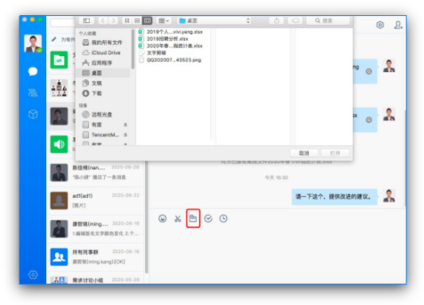

# Mac客户端使用手册

## 1. 下载

Mac客户端下载，可直接在有度即时通官网下载；链接：

https://youdu.im/download.html。

## 2. 安装

下载完成安装包，单击运行，显示以下弹窗，选中拖至应用程序即可。

## 3. 登录

**要成功登录，第一步要先完成服务器设置，第二步要选择登录模式，完成帐号信息设置。**

安装完成将进入登录界面，点击右下角的服务器设置按钮；

服务器类型有两种：1)通过服务器地址登录，2)通过总机号登录；

请根据贵司管理员的要求选择相应类型，并填写相关的信息，点击确定以保存。

注意：Mac客户端仅支持账号密码登录。

## 4. 通讯录

### 4.1 通讯录界面

通讯录界面是以树状形式展示企业组织架构，鼠标单击同事帐号，将展示该同事的个人资料卡。

### 4.2 通讯录中查找同事

- 直接在组织架构中点开查找
- 点击窗口顶部搜索框，在搜索框输入姓名或账号可进行模糊搜索。

## 5. 会话

### 5.1 会话界面

会话列表根据时间由新到旧显示会话记录，您可以快速查找近期会话，左键单击快速进入会话窗口。

进入单人或群组会话窗口，窗口内可发送文字、表情、文件等进行日常沟通，还可以查阅之前的消息记录。

### 5.2 发起单人会话

在组织架构中，鼠标左键双击账号或者单击显示资料卡，点击发消息，即可发起单人会话

通过顶部搜索框，搜索账号，单击打开会话窗口，即可发起个人会话。

### 5.3 发起群组会话

- 打开单人会话窗口，点击窗口右上角，选择参与者，点击确定；

- 点击顶部【+】，选择参与者，点击确定发起群组会话。

### 5.4 发送文件

- 点击会话窗口的文件按钮选取文件；

- 直接拖拽文件或复制粘贴文件至会话窗口。

## 6. 常用

### 6.1 常用界面

常用界面显示的是常用联系人（包含上线提醒联系人）、常用群组（固定群和讨论组）和常用部门。

### 6.2 设置常联系人

- 在会话列表界面，鼠标右键单击，添加到常用联系人；
- 在单人会话窗口，点击设置，添加到常用联系人。

### 6.3 设置上线提醒

- 在会话列表界面，鼠标右键单击，上线提醒；
- 在单人会话窗口，点击设置，开启上线提醒。

### 6.4 设置常用群组

- 在会话列表界面，鼠标右键单击，添加到常用群组；
- 在群组会话窗口，点击右上角设置按钮，勾选添加到常用群组。

### 6.5 设置常用部门

- 通讯录界面，选择部门，鼠标右键单击，添加到常用部门

## 7. 设置

- 登录成功后进入使用界面
- 直接点击头像，可对个人基本资料进行修改

- 点击界面左上角【有度即时通】，可对系统设置进行设置，包含文件保存路径、快捷键等。

