# Linux客户端使用手册

## 1. 下载

- 访问有度即时通官网

https://youdu.im/download.html

- 点击Linux客户端下载

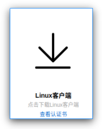

- 选择安装包

Linux客户端支持DEB和RPM格式，用户可根据实际客户端系统进行下载安装使用；

有度已在以下系统完成测试验证：Ubuntu16、Ubuntu18、中标麒麟（x86_64）、中标麒麟（loogson）、深度系统15。

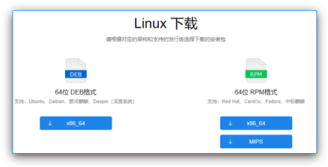

## 2. 安装

双击运行安装包，点击安装

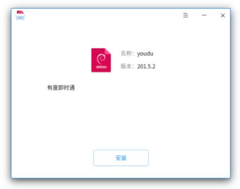

提示安装需要授权时，输入当前登录系统账号的密码，点击认证后等待程序安装完成即可。

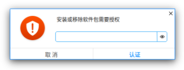

## 3. 登录

要成功登录，第一步要先完成服务器设置，第二步要选择登录模式，完成帐号信息设置。

### 3.1 服务器设置

安装完成将进入登录界面，点击右上角的服务器设置按钮；

服务器类型有两种：1)通过服务器地址登录，2)通过总机号登录；

请根据贵司管理员的要求选择相应类型，并填写相关的信息，点击确定以保存。

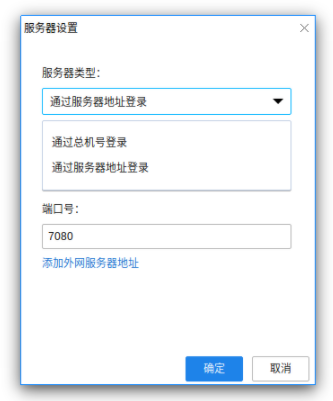

### 3.2 选择登录模式

目前支持三种登录模式：帐号登录、手机号登录、二维码登录；

请根据贵司管理员要求选择登录模式以及完成相关信息输入。

- 账号密码方式登录

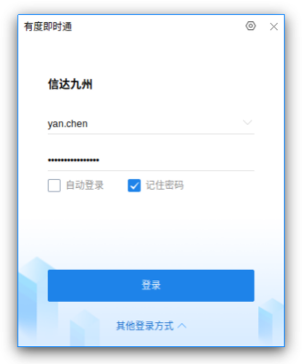

- 手机号方式登录：输入手机号，获取短信验证码

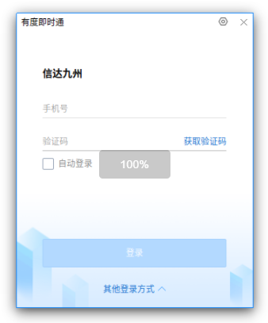

- 二维码方式登录：打开已登录的有度移动端，选择【扫一扫】，扫描登录界面的二维码

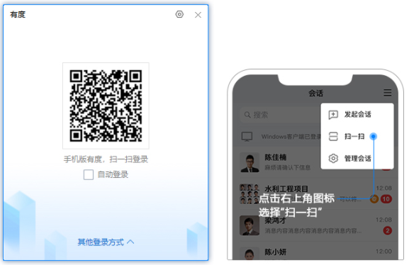

## 4. 通讯录

### 4.1 通讯录界面

通讯录界面是以树状形式展示企业组织架构，鼠标点击同事帐号，将展示该同事的个人资料卡

### 4.2 通讯录中查找同事

- 直接在组织架构里面找；
- 点击搜索框，在搜索框内输入其姓名、账号或者包含该同事的会话进行模糊搜索。

## 5. 会话

### 5.1 会话界面

会话列表根据时间由新到旧显示会话记录，您可以快速查找近期会话，左键双击快速进入会话窗口。

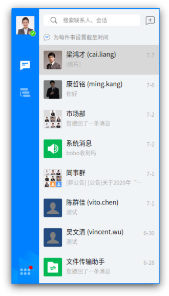

进入单人或群组会话窗口，窗口内可发送文字、表情、文件等进行日常沟通，还可以查阅之前的消息记录。

### 5.2 发起单人会话

- 在通讯录界面，鼠标左键双击同事账号，进入会话窗口
- 在通讯录界面，鼠标左键单击同事账号，右侧资料卡展示底部，点击发送消息按钮，进入会话窗口。
- 在通讯录界面，鼠标右键单击同事账号，点击发送消息，进入会话窗口。

### 5.3 发起群组会话

- 打开个人会话窗口，点击右上角【+】，选择参与者，点击确定；

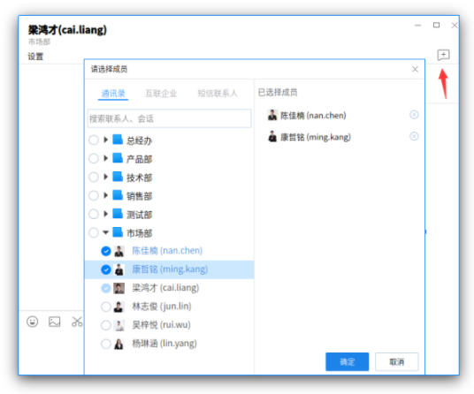

- 点击搜索框右侧【+】，单击选中参与者，点击确定发起群会话。

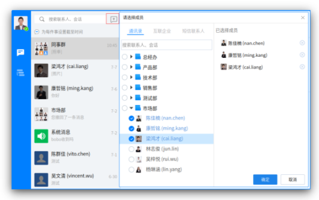

### 5.4 发送文件

点击会话窗口的文件按钮，选取文件进行发送。

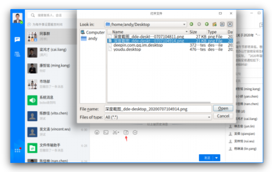

直接把文件移动或者粘贴在会话窗口。

## 6. 常用

### 6.1 常用界面

常用界面显示的是固定群（由管理员创建）、常用群组、常用部门、常用联系人、上线提醒联系人等入口

设置常用群组

点击群组会话设置按钮，勾选添加常用群组。

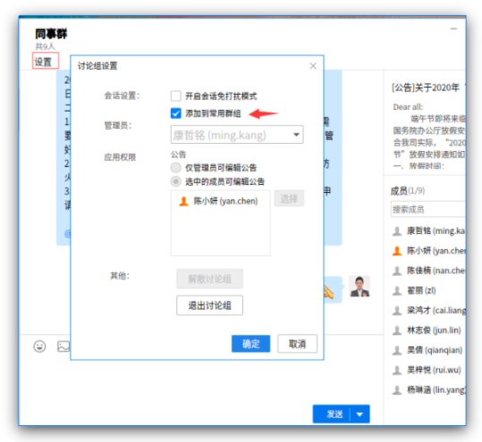

设置常用联系人

- 单击同事个人资料卡，添加到常用；

- 点击会话窗口设置，勾选常用联系人。

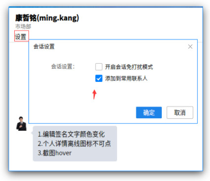

## 7. 工作台

工作台主要放置常用应用的入口（由管理员设定）

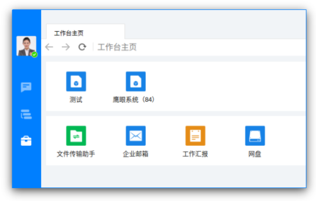