# 手机客户端使用手册

## 1. 有度下载安装

手机应用商店，搜索“有度即时通”，下载安装即可。

## 2. 登录

如何成功登录有度移动端？

- 第一步要先完成服务器设置；

- 第二步要选择登录模式，完成帐号信息设置。

### 2.1 服务器设置

安装完成，进入登录界面，点击右下角服务器设置按钮；

服务器类型有两种：1)通过服务器地址登录，2)通过总机号登录；请根据贵司管理员的要求选择相应类型，并填写相关的信息，点击确定保存。

 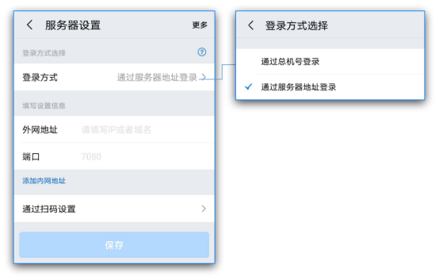

### 2.2 选择登录模式

配置完服务器设置后，可选择登录模式；

支持两种登录模式：1）账号密码登录；2）手机号登录；

默认以【账号密码登录】，点击【手机号登录】，可通过绑定的手机号，获取验证码登录有度移动端。

请根据贵单位管理员要求选择登录模式以及完成相关信息输入；

- 账号密码登录：输入账号密码；

- 手机号登录：输入已绑定有度账号的手机号，获取短信验证码。

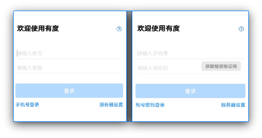

## 3. 搜索按钮

正常登录有度移动客户端后，界面展示分为四部分，分别为【会话】、【通讯录】、【工作】和【我】。

- 搜索按钮存在于通讯录视图和会话视图，可根据搜索的内容进行指定搜索；支持搜索联系人、群组、部门、企业应用、聊天记录、收藏记录、手机号码查询。

- 【Android端】

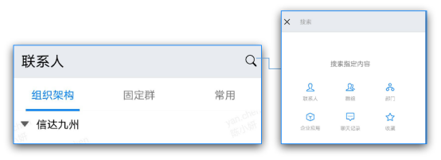

- 【iOS端】

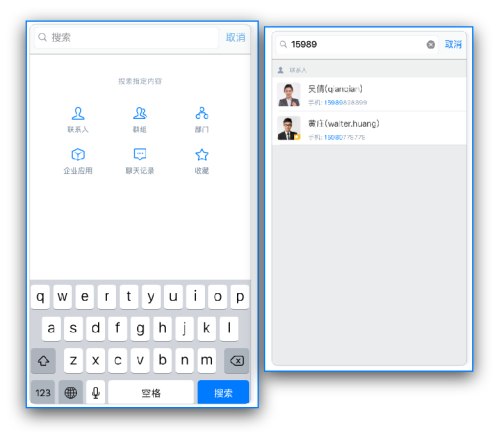

## 4. 通讯录

在通讯录视图中，主要分为三部分，组织架构、固定群和常用。

### 4.1 组织架构

组织架构是通讯录视图的第一部分，是以树状形式展示企业组织架构的，点击部门可进行展开，显示该部门所有成员；选择点击同事，将展示同事的个人资料卡。

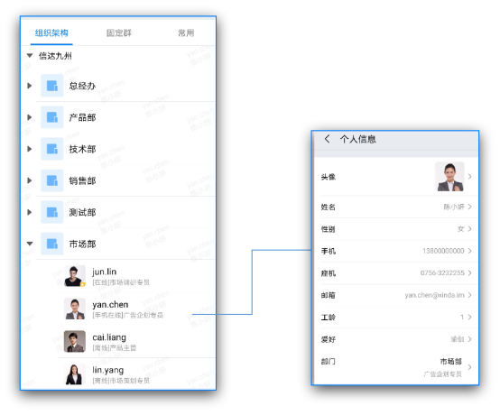

#### 4.1.1 通讯录中查找同事

- 直接在组织架构中点击对应部门，进行准确人员查找；

- 使用搜索按钮，指定搜索内容为联系人，可进行精准或模糊查找。

### 4.2 固定群

固定群是通讯录视图的第二部分，主要是显示该账号包含在内所有固定群的列表；如果固定群过多，可通过右上角的搜索按钮，进行固定群的查找。

注意：固定群由单位管理员统一创建管理，客户端无法创建固定群，只能创建讨论组。

 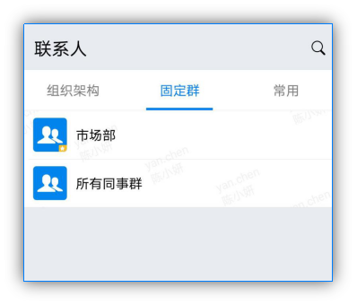

### 4.3 常用

常用是通讯录视图的第三部分，主要显示用户的常用联系人、常用群组和常用部门，用户可根据使用需求，将常用的联系人、群组或部门添加到该界面，以便于后续快速查询。

#### 4.3.1. 设置常用

- 常用联系人：

打开移动端-【通讯录】-【组织架构】-打开部门-点击账号-个人信息界面-勾选常用联系人；则被勾选账号已设置为常用联系人，将显示在常用联系人列表。

- 常用群组：

打开移动端群组会话-右上角群组详情-勾选【常用群组】；无论固定群或是讨论组，都可设置为常用群组，被勾选群组将显示在常用群组列表，方便查询。

- 常用部门：

打开移动端-【通讯录】-【组织架构】- 长按所选部门 - 选择【添加到常用部门】；被勾选部门将显示在常用部门列表。

 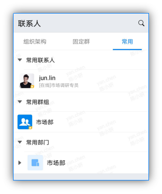

## 5. 会话

### 5.1 会话界面

#### 5.1.1 会话列表

会话列表根据时间由新到旧显示会话记录，您可以快速查找近期会话，点击会话即可快速进入会话窗口。

点击右上角，可选择发起会话、扫一扫和管理会话。

  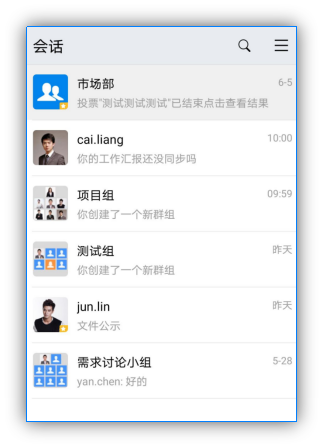

#### 5.1.2 会话内容页

进入会话内容页，支持发送图片、文件、位置消息、拍照、录像、语音视频、回执消息。

 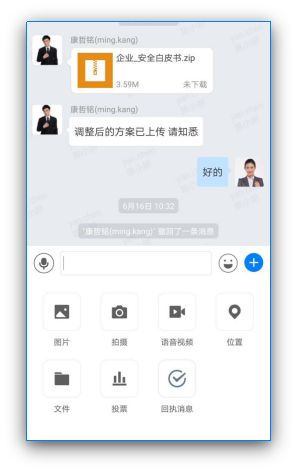

#### 5.1.3 会话详情页

支持设置常用、消息免扰、置顶会话、群公告、搜索会话内容、增删会话成员、进行群管理。

 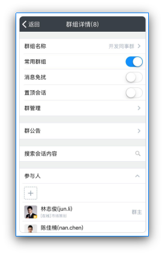

### 5.2 发起个人会话

- 在组织架构界面中，找到对应的同事账号，点击进入个人资料卡视图，点击右下角的【发消息】即可发起会话。

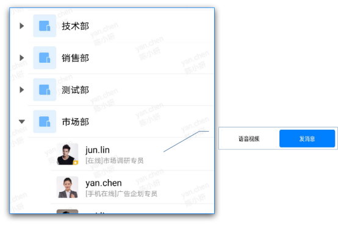

- 使用搜索窗口，搜索联系人，点击账号进入个人资料卡视图，点击【发消息】即可发起会话。

 

- 在群组详情界面中，点击参与人列表中账号，即可发起会话。

 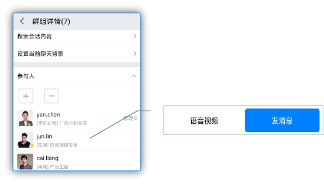

### 5.3 发起群组会话

- 切换至固定群界面，在固定群列表中，选择需要发起会话的群，点击即可发起会话。

- 如果需要发起部门或则全员的讨论群组会话，在组织架构中，长按部门，根据弹出的选项进行发起。

 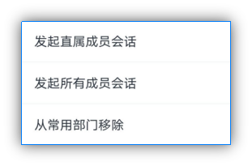

- 在个人会话中，如果需要拉取更多成员进行会话时，可在个人会话详情中的参与人列表中，点击【+】选择需要添加的成员，即可发起群组会话。

 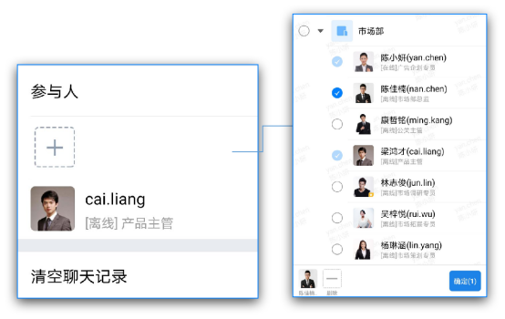

## 6. 工作门户

工作台主要放置常用应用的入口（由管理员设定），如邮箱、网盘、工作汇报和打卡应用等。

 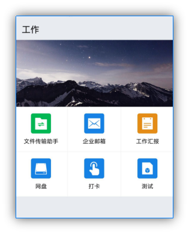

## 7. 我（个人设置）

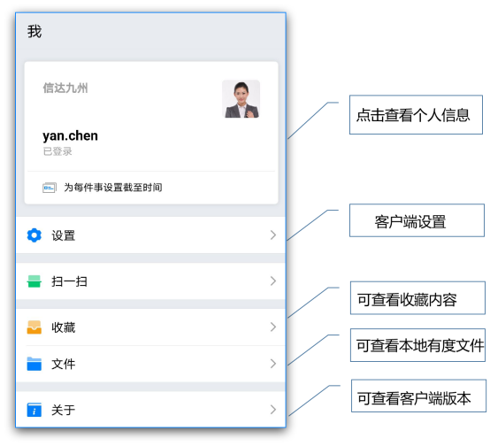

### 7.1 设置

涉及到客户端设置，主要是有度新消息提醒设置、有度自启设置引导和来电识别设置。用户可根据需要进行相关的设置。

#### 7.1.1 有度新消息提醒

 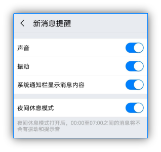

#### 7.1.2 有度自启设置引导

【Android启用来电识别操作】

[客户端开启自启动权限指南](https://youdu.im/android_power_custom/index.html)。

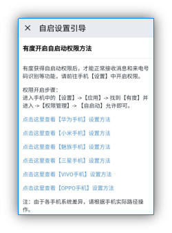

【iOS启用来电识别操作】

[系统设置]-[电话]-[来电阻止与身份识别]-[启用有度]。

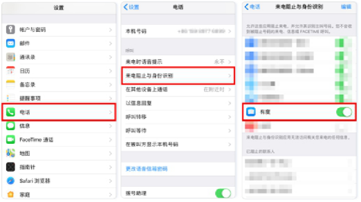

#### 7.1.3 来电识别设置

陌生来电支持通过组织架构自动匹配，可直接显示同事姓名和部门信息。

 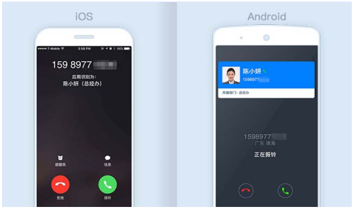

位置：[我]-[设置]-[来电识别]。

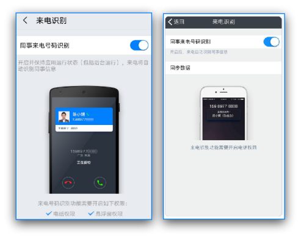